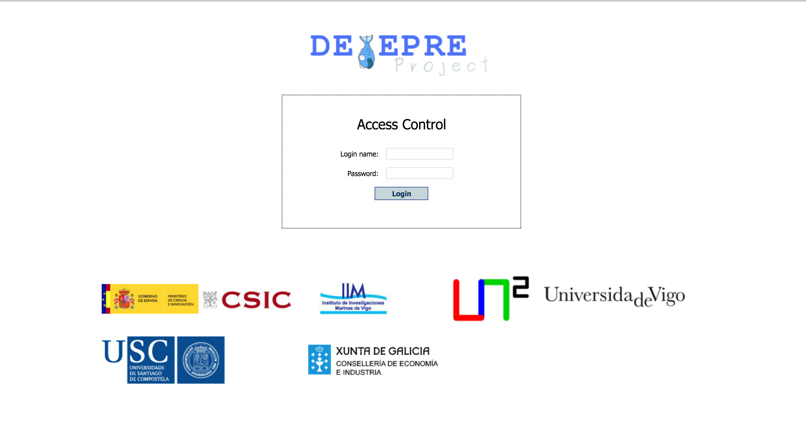

Govocitos is a free software destinated to determine reproductive parameters in fish. It is able to estimate fertility and study the dynamics of development and oocyte recruitment of commercial fish quickly, easily and accurately. Knowledge of these parameters allows improving the assessment and fisheries management. Govocitos features an intuitive interface that easy to use.

See more information about Govocitos at [http://lia.ei.uvigo.es/daeira/software/govocitos](http://lia.ei.uvigo.es/daeira/software/govocitos).

# Setup
This repository contains the Dockerfiles that start Govocitos's Web Application.

To launch the service run 

`docker-compose up -d --force-recreate`

Check that all services (Apache Tomcat and MySQL) are up running.

```
govocitos git:(master) docker-compose ps
  Name             Command       State           Ports
------------------------------------------------------------------
govocitos-mysql   /run.sh           Up      0.0.0.0:3306->3306/tcp
govocitos-web     catalina.sh run   Up      0.0.0.0:8080->8080/tcp
```

The `docker-compose.yaml` file exposes both MySQL and Tomcat respectevely. Feel free to modify the file according to your needs.

# Usage

Browse to `localhost:8080/detepre/` or to your `$DOCKER_HOST:8080/detepre` to reach Govocitos's Web Application.

You should be able to see the login panel:



Log into the service using the following credentials:

- Guest account: `guest:guest`
- Operator account: `operator:???`
- Admin account: `admin:???`
